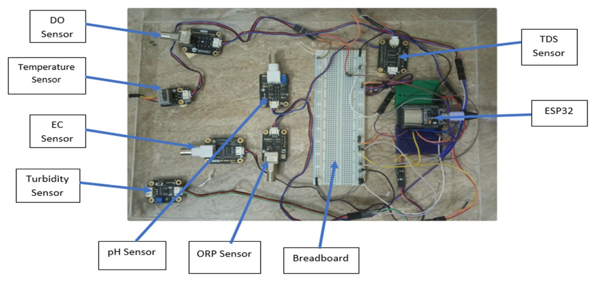
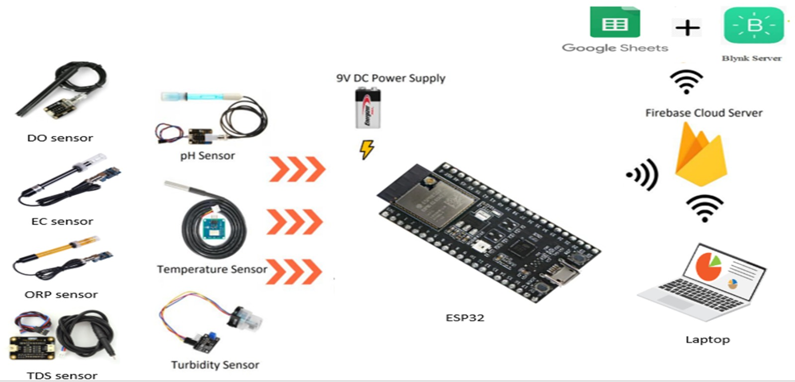
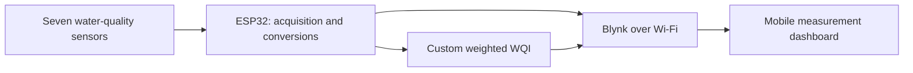
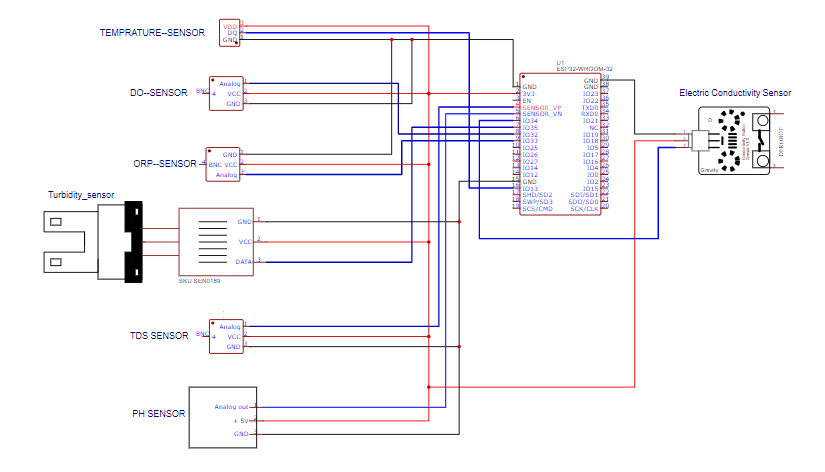
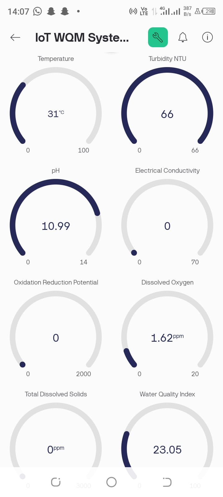
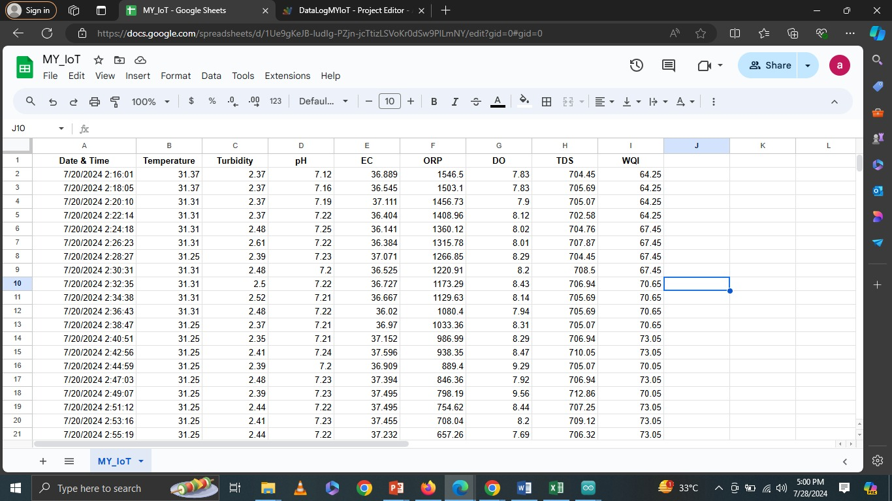

# IoT Water Quality Monitoring System

An ESP32-based prototype that brings seven water-quality measurements into a Blynk mobile dashboard and calculates a custom Water Quality Index (WQI). The project documentation also demonstrates timestamped measurements recorded in Google Sheets.



## Problem statement

Water quality depends on several physical and chemical properties. Checking isolated measurements manually makes it difficult to follow changes over time or view conditions remotely. This project explores how a connected, multi-sensor prototype can collect those measurements in one place and present an accessible summary.

## What I achieved

- Assembled an ESP32 prototype with temperature, turbidity, pH, electrical conductivity (EC), oxidation-reduction potential (ORP), dissolved oxygen (DO), and total dissolved solids (TDS) sensors.
- Implemented sensor acquisition, voltage conversion, calibration equations, and selected filtering routines in Arduino C++.
- Sent seven measurements and a calculated WQI to eight Blynk virtual datastreams over Wi-Fi.
- Created a mobile dashboard with individual measurement gauges and an overall WQI gauge.
- Demonstrated timestamped records of all seven parameters and WQI in Google Sheets, as shown in the supplied logging screenshot.
- Documented the system architecture, circuit connections, assembled hardware, dashboard, and recorded data.

These materials demonstrate a working monitoring prototype; they do not establish measurement accuracy, long-term reliability, or suitability for certifying drinking water.

## System architecture





The architecture illustration also includes Google Sheets and Firebase. The supplied firmware implements Blynk communication. The Google Sheets screenshot provides evidence of logged records, but the logging script and data-transfer route were not supplied. Firebase integration is depicted in the architecture and is not verified by the supplied firmware or screenshots.

## Hardware and connections

| Measurement | ESP32 GPIO in firmware | Blynk pin | Reported unit |
| --- | --- | --- | --- |
| Temperature | 13 (OneWire) | V0 | °C |
| Turbidity | 35 (analog) | V1 | NTU |
| pH | 39 (analog) | V2 | pH units |
| Electrical conductivity | 34 (analog) | V3 | mS/cm, as labeled by firmware |
| Oxidation-reduction potential | 32 (analog) | V4 | mV |
| Dissolved oxygen | 33 (analog) | V5 | mg/L |
| Total dissolved solids | 36 (analog) | V6 | ppm |
| Custom Water Quality Index | Calculated | V7 | Custom score |

Additional hardware includes the sensor interface modules, breadboard, jumper wires, and a suitable regulated supply. The architecture image shows a 9 V source; supply and signal conditioning must follow the actual ESP32 board and sensor module specifications. Do not connect a 9 V source to the ESP32's 3.3 V rail or GPIO. Check every analog module's output voltage against the ESP32 input limit before wiring.



The pin table above is derived from the supplied code. Cross-check the circuit drawing and actual module pin labels against this table before reproducing the prototype.

## Firmware behavior

The main loop reads the sensors, converts readings, calculates parameter subindices, and publishes the values with `Blynk.virtualWrite()`.

- **Temperature:** OneWire and DallasTemperature retrieve the probe reading.
- **pH:** ten ADC samples are sorted; the middle six are averaged and converted using two voltage/pH reference points.
- **Turbidity and TDS:** linear interpolation converts measured millivolts using project-specific reference values.
- **EC:** the raw ADC reading is divided by project-specific scaling constants.
- **ORP:** a 40-value buffer is processed with an averaging routine that removes a minimum and maximum sample.
- **DO:** a saturation lookup table and calibration voltage convert the sensor voltage to a reported mg/L value.
- **WQI:** discrete subindices are combined with the weights below.

The loop ends with a 500 ms delay, but temperature conversion, sampling, network calls, and other operations increase the total cycle time. A fixed 2 Hz measurement rate has not been demonstrated.

## Custom Water Quality Index

```text
WQI = 0.10 × S_temperature + 0.15 × S_pH + 0.17 × S_TDS
    + 0.15 × S_turbidity + 0.12 × S_ORP + 0.18 × S_EC
    + 0.15 × S_DO
```

`S` is the corresponding subindex returned by the firmware's threshold functions. Higher subindices represent conditions preferred by those project-specific rules.

The weights sum to **1.02**, so the theoretical maximum is **102**, even though the dashboard is shown with a 0–100 gauge. The calculation is a custom prototype index; no published WQI standard, validated classification scale, or potability assessment is established by the supplied materials.

## Demonstration results

| Evidence | Examples visible in the supplied screenshot |
| --- | --- |
| Blynk dashboard | Temperature 31 °C; turbidity 66 NTU; pH 10.99; DO 1.62 ppm as labeled on the gauge; WQI 23.05 |
| Google Sheets records | Temperature about 31.25–31.37 °C; pH about 7.12–7.24; TDS about 702.58–712.86 ppm; WQI 64.25–73.05 |

The screenshots show different captured conditions, not simultaneous measurements or a controlled before/after test. Zero values visible on some dashboard gauges do not prove that those sensors measured zero. The firmware reports DO in mg/L while the gauge labels it ppm; unit labels should be reconciled during setup. EC values in the sheet also require calibration/unit verification against the firmware's reported scale.





## Getting started

1. Install the Arduino IDE and ESP32 board support. Select the board matching your hardware.
2. Install the **Blynk**, **OneWire**, and **DallasTemperature** libraries. `WiFi`, `HTTPClient`, and `Wire` are provided with the ESP32 Arduino environment; HTTPClient and Wire are included but unused in this sketch.
3. Open [firmware/water_quality_monitor/water_quality_monitor.ino](firmware/water_quality_monitor/water_quality_monitor.ino).
4. Replace `YOUR_BLYNK_TEMPLATE_ID`, `YOUR_BLYNK_TEMPLATE_NAME`, `YOUR_BLYNK_AUTH_TOKEN`, `YOUR_WIFI_SSID`, and `YOUR_WIFI_PASSWORD` with your own configuration. Do not publish populated credentials.
5. Create Blynk datastreams V0–V7 using the table above and assign them to dashboard gauges. Set ranges and units appropriate to calibrated measurements; account for the current WQI maximum of 102.
6. Wire the actual sensor modules using verified power and signal requirements. Calibrate every sensor against suitable references and review the conversion constants in the code.
7. Upload the sketch and inspect Serial Monitor output at **9600 baud**, then compare it with the Blynk readings.

Google Sheets logging cannot be reproduced from this firmware alone. Add the original logging script/integration and its setup instructions when available. Firebase configuration is also outside the supplied implementation.

## Known limitations and next improvements

- Normalize WQI weights if a true 0–100 scale is intended, and validate the subindex rules for the target use case. Some EC and ORP threshold boundaries currently leave gaps.
- Replace DO's fixed `READ_TEMP` value of 32 °C with a validated measured-temperature compensation path. Enforce lookup-table bounds if this is changed.
- Validate EC scaling, sensor reference voltages, and all calibration equations. TDS and turbidity interpolation can extrapolate outside the reference range.
- Handle disconnected probes, startup buffers, implausible readings, Wi-Fi outages, and cloud reconnection explicitly.
- Use scheduled nonblocking acquisition to avoid delaying `Blynk.run()` and to control the actual update interval.
- Supply the Google Sheets logging implementation and clarify whether Firebase was implemented.
- Compare readings with reference instruments and report accuracy, repeatability, and response time. No quantitative validation results were supplied.
- Add configurable alerts and historical trend analysis as future features; neither is implemented in the supplied sketch.

## Repository contents

```text
README.md
firmware/water_quality_monitor/water_quality_monitor.ino
images/
  architecture.jpeg
  circuit.png
  dashboard.jpeg
  hardware.jpeg
  logging.jpeg
poster/
  iot-water-quality-poster.pdf
  iot-water-quality-poster.png
tools/build_poster.py
```

The firmware is a credential-sanitized copy of the supplied `BLYNK.txt`. Duplicate Blynk template definitions were removed; measurement logic was preserved. It has not been compiled or tested on hardware in this documentation task.

## Project poster

[Download the A2 PDF poster](poster/iot-water-quality-poster.pdf) · [View the PNG poster](poster/iot-water-quality-poster.png)

The poster uses all five supplied project images. Its text is preserved as selectable text in the PDF. To regenerate it, install Pillow and ReportLab, then run `python tools/build_poster.py` from this directory. The script uses Arial on Windows or DejaVu Sans on Linux.

**Author:** Syed Affan Ali

No license was supplied for the project code or imagery. Choose an appropriate license before offering reuse permissions.
